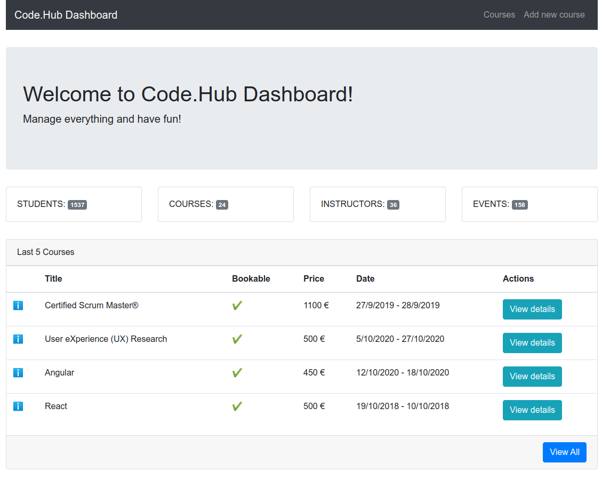
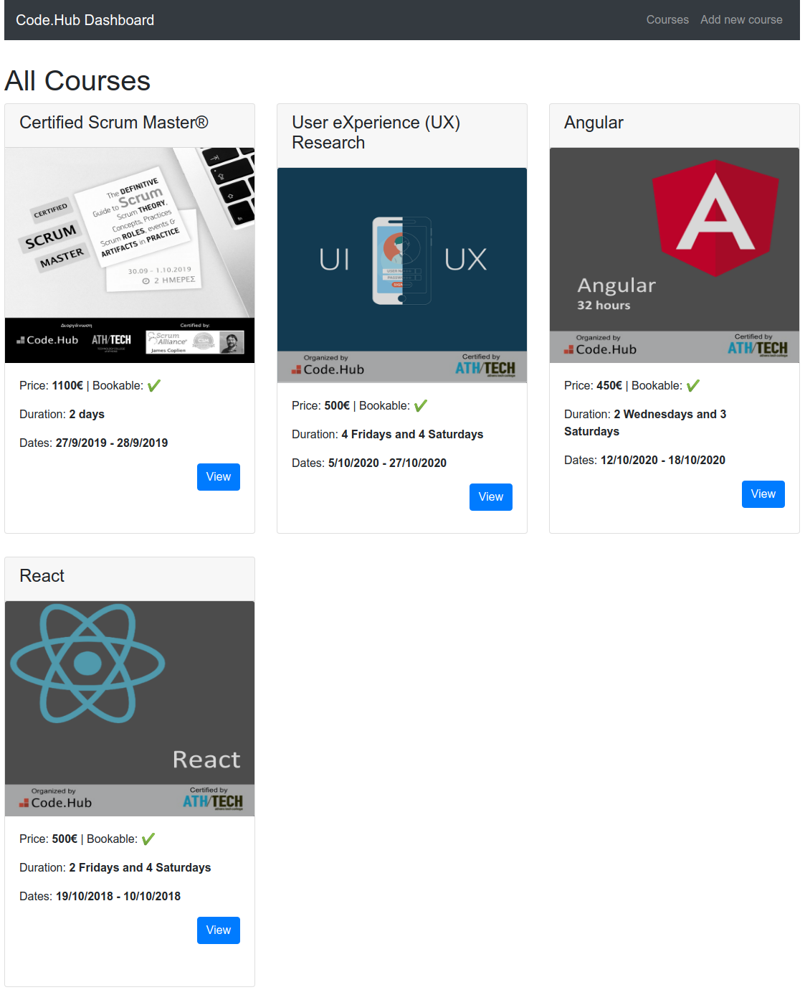
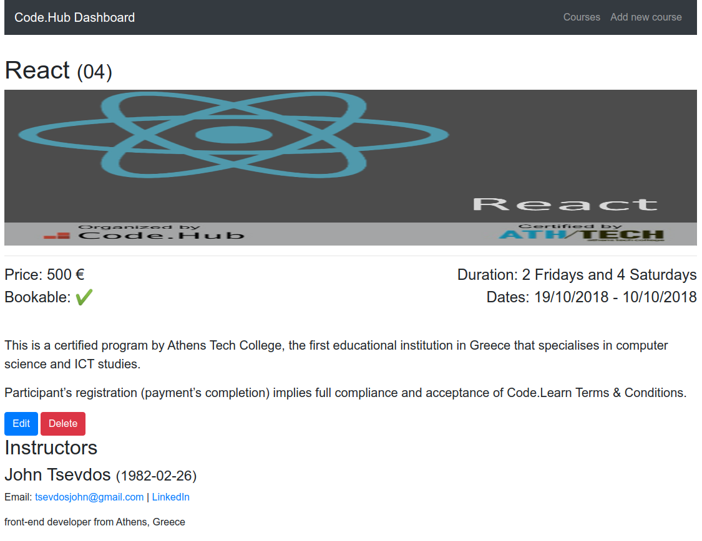
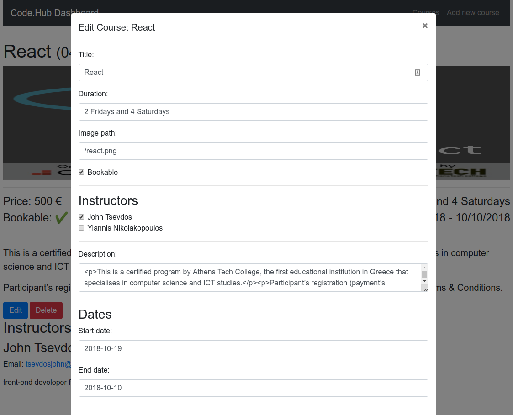
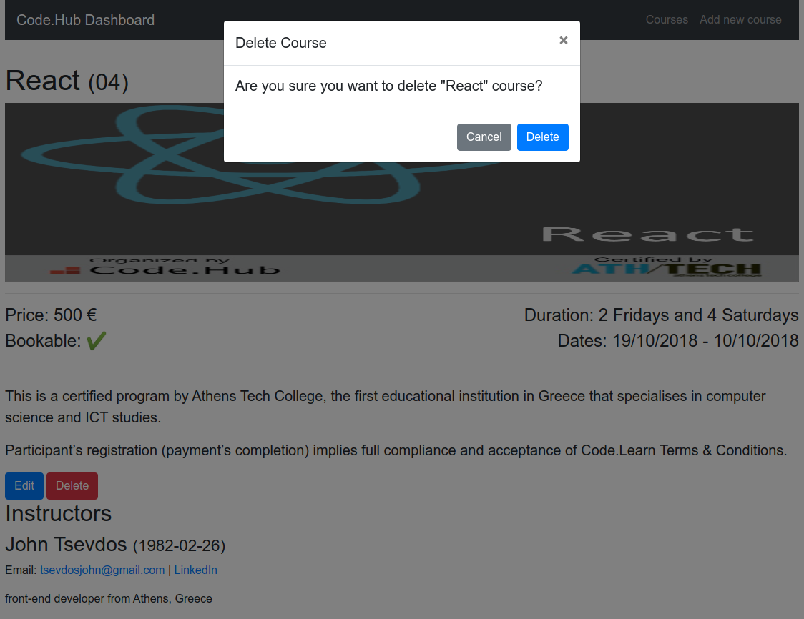
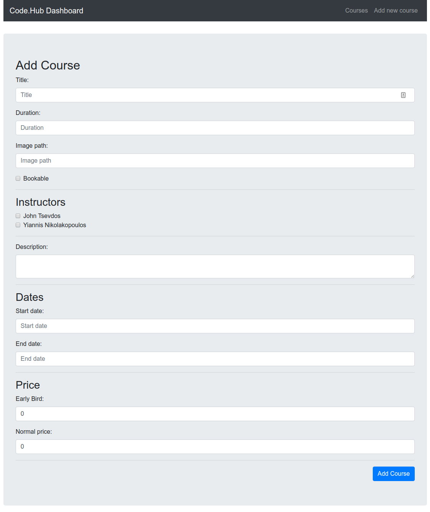

# React Project

This project was implemented as part of our 100 hours Front-End Web Development hands-on training, powered by CodeHub and ReGeneration.

## App details

The application was bootstraped using [Create React App](https://reactjs.org/docs/create-a-new-react-app.html). 
We added these extra libraries:

- [React Router](https://github.com/ReactTraining/react-router) - for client-side (browser) routing
- [axios](https://github.com/axios/axios) - for HTTP requests
- [React Bootstrap](https://react-bootstrap.github.io/) - for building the App
- [React Icons](https://react-icons.github.io/react-icons/) - for including some popular icons to our project
- [React-Moment](https://www.npmjs.com/package/react-moment) - for Date Format
- [react-scroll-restoration](https://www.npmjs.com/package/react-scroll-restoration) - for a smooth scroll restoration in SPA

## Fake REST API

The only already installed dependency is the [JSON server](https://github.com/typicode/json-server) (development dependency), a "fake" REST API. This API exposes 3 different resourses 

## Run locally

You need to have node.js installed. I am using node version `12.17` and npm version `6.14.4`, but you can use any modern node/npm version you want. When you are ready, you can install all dependencies and run the development servers by typing the below commands:

```
npm install
npm run api // Runs API server in port 3001
npm start // Runs the create react app server in port 3000
open http://localhost:3000
```


## User stories

### Dashboard page

The dashbord page contains:

1. Code.Hub's stats (students, courses, instructors and events)
2. a list with the last 5 courses
3. every course must have a link that leads to the course details page
4. a link that leads to the courses page

#### Dashboard (sample)



### Courses page

The courses page contains:

1. all the available courses
2. every course must have a link that leads to the course details page

#### Courses Page (sample)



### Course details page

The course details page contains:

1. all the details of the course
2. all the course instructors
3. an edit button that will edit the current course (edit the course inline or in another page)
4. a delete button that will delete the current course

#### Courses Details Page (sample)



#### Edit Details (sample)



#### Delete Course (sample)



### Add new course page

The add new course page must contain:

1. a form with the appropriate course fields
2. a submit button that posts the data correctly

#### Add new course page (sample)



